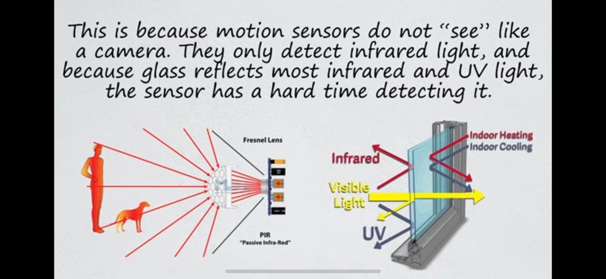
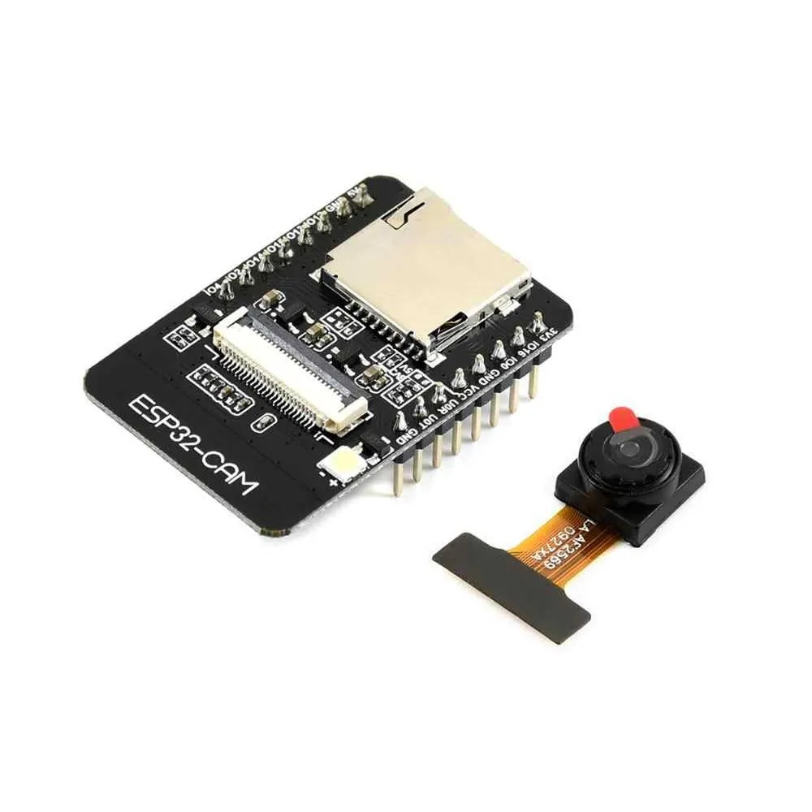

## About 

Example of usage [EloquentEsp32cam](https://github.com/eloquentarduino/EloquentEsp32cam) library.

## Problem

For example, you want to monitor activity behind a glass window and, if motion is detected, take a screenshot and send it over the network to a telegram bot.

The first solution that comes to mind is to use a PIR sensor. But this solution will not work, because... glass reflects ultraviolet and most infrared light.



In the working solution, the PID sensor is excluded from the circuit. The camera takes pictures at a certain frequency and compares them with each other, if the comparison algorithm considers that the discrepancies between the frames are significant, the motion trigger is triggered.

## Components

ESP32 Ai Thinker Cam



## Settings

`secrets.h.example`:

```
// wifi
#define WIFI_SSID "wifi network"
#define WIFI_PASS "wifi network pass"

// telegram
#define TELEGRAM_TOKEN "telegram token from @BotFather"

/*
Request:
https://api.telegram.org/bot<TELEGRAM_TOKEN>/getUpdates (Before execute http request you should send at least one message to bot)

Response:
...
"chat": {
    "id": <CHAT_ID>,
    "first_name": "...",
    "username": "...",
    "type": "private"
}
...
*/ 
#define TELEGRAM_CHAT "CHAT_ID"
```

## Links

[ESP32 cam motion detection without PIR](https://eloquentarduino.com/posts/esp32-cam-motion-detection)